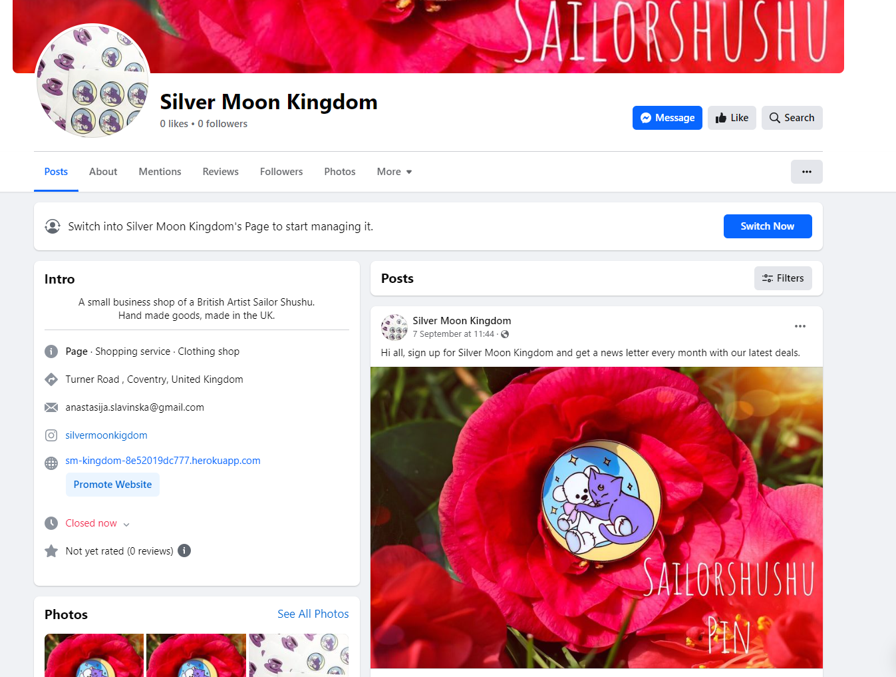
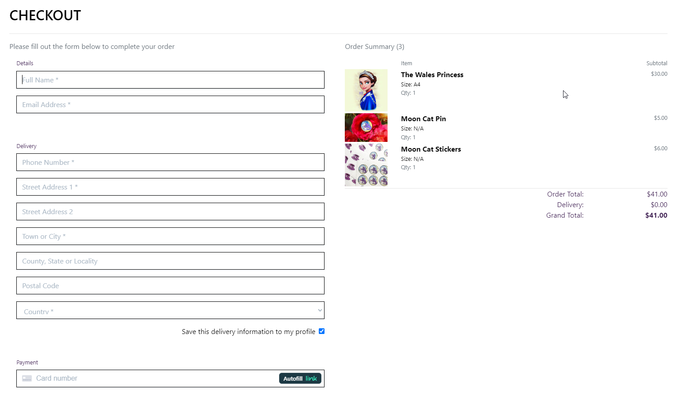
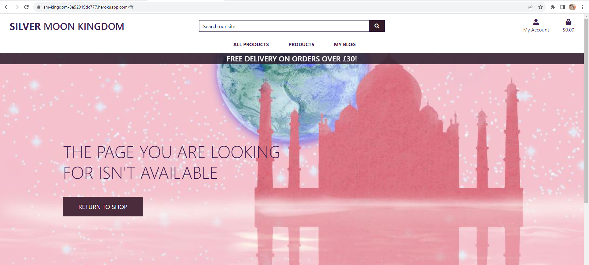

# Silver Moon Kingdom

The official website of a British Artist Sailor Shushu online shop Silver Moon Kingdom. This page is created for Sailor Shushu's fans, as a business to client model and be able to purchaise limited eddition items of her design, if other artist will decide to collaborate, there is an option for more artists to be added and their prints can be sold too.  

 - ! Due to some unfortinate tutoring, the initial project structure callapsed beyond fixing, so the canban board stays with the project 5 folder and this is a copy paste from the project 5 [github link](https://github.com/aslavinska/project5)
 - This project [link to github](https://github.com/aslavinska/smkingdom)
 - Due to time limititation it was decided not to copy and paste everything but to keep it within the two repositories. 

# Web Marketing 
(Application purpose and use)

* Who are your users?
    - Sailor Shushu Artist Fans
* Which online platforms would you find lots of your users?
    - Instagram and Facebook
* What do your users need? 
    - Cool art products, unique designs in the artists style.
* Would your business run sales or offer discounts? 
    - There is a potential to have deals and discounts and discount codes with stripe. 
* What are the goals of your business?
    - To sale art and unique stickers and pins made in UK. 
* Which marketing strategies would offer the best ways to meet those goals?
    - Seller to Client direct advertismenet without 3rd party. 
* Would your business have a budget to spend on advertising? 
    - No, will work with free or low cost options to market itself. 

- **Facebook Business page**

- This is a mock facebook page that could be deleted by Facebook, as the business is not real. 

# Features

- **Navigation**
    - Featuring at the top of the main page, the name of the online shop Silver Moon Kingdom.
    - The other navigation links are: All Products, Pins & Stickers and Prints, Login/Logout and Register options. 
        - When logged as admin also see Product Management drop down and Artist Managemenet drop down. 
        - When logged in as user see My Profile drop down option. 
    - My blog page is visible each post can be expanded and users can leave comments on the posts that need to be reviewed and approved by an admin, before they can be visible. 
    - The navigation is in a font visible and readable for a user and color that contrasts with the background. 
    - The navigation clearly tells to the user the name of the website, and makes the different sections of information easy to find. 
    - Search bar is available on the top of the page
    - In the Footer users can find link to the facebook page of the shop and subscripe for newsletter. 

- **The Main Page**
    - The header shows the name of the app, using the other color chosen: Shade of purple with stylish font theme. 
    - This section provides the user with clear information about what the site is and who is the targetted audience. 
    - When clicked on the website name, the user is taken back to the main page. 
    

- **Online Shop**
    - One-time sale model is used
    - Business to client model, where the art creater sales her art directly to her fans. 
    - 3 product types are available: Pins, Stickers and Prints. 
        - For Prints user can select print size and print option.
        - a buyer can arrange products by price, category, rating or select all products in All products drop down manus.
        - a buyer can select products based on their group: just see pins, stickers or prints in Products drop down menu. 

- **Product Details**
    In the product details page now users can see category of the product and an artist name, both can be clicked and the link will open all products under the same category or atist.
    Also, in prints users can see prinst print options and can select what print options they want before checking out the print. 
    

- **Product Management Section**
    - The about section gives details background about artist and motivation behind each art.
    - Admin can edit, delete and add new art prints without login to the admin page. 
    (Note: the screen below has been zoomed out in order to fit in all fields.)
    

- **Artist Management Section**
    - The about section gives details background about artist and motivation behind each art.
    - Admin can add new artists without login to the admin page. 
    

- **Basket Section**

- Shopping bag
    - In the shopping bag section a buyer can edit items by inscreasing, decreasing quantity of an item and removing it from the shopping bag.

   

- Checkout
    - The buyer will be asked to enter shipping details and card payment will be done via Stripe paying system. 
    - At the checkout the buyer will be able to see the final list of items before the purchaise:
   

    
- **Login/Logout/Register**
    - Drop down view:
        

    - Users can register using their email and password
    - Register panel:
    

    - Login panel:
    

    - Sign out:
    

- **Footer**
    - The fotter includes social media links to the facebook store page and subscription to the email service.
    

- **Custom 404**

# Project Agile Kanban board:
 - The project kanban board can be found [here](https://github.com/users/aslavinska/projects/3/views/1)

# Custom Models:
ERD:

# Testing
 - I have tested this page in brosers: Chrome and Firefox.
 - I confimed that this project is responsive, looks good and functions on all standard screen sizes using the devtools device toolbar.
 - I confirmed that the navigation, search, product pages, management pages, user pages and login/register/logout are all readable and easy to understand. 
 - I have confirmed that the form works: requires entries in every field, will only accept an email in the email field and the submit button works. 
 - I can confirm that post edit and delete functions work in the UI and models are updated without entering the admin panel.
 
 - Site Pagination Tests: 
        
    1. Verified that pagination is shown on the page load.
    2. Made sure that the default page should be selected on the page load.
    3. Checked proper space should be added for clicking on the links and buttons for both mobile and desktop screens.
    4. Made sure colour the text is changing when hover over the menu.
    5. Verified the font size and color for the pagination should be same as per design and requirement.
    6. Verified accurate results should be generated by clicking the buttons.
    7. Tested the data loading time on the page as the user clicks on the links.

- Open a product Tests:
    1. Verified that product details are shown on the page load when clicked.
    2. Drop downs are working, selecting a product is working, increasing or decreasing item number is working, adding to bag is working.
    3. When added to the bag a success message pops up

- Edit Delete Add products for admin 
    1. Verified that only admin can see edit and delete buttons inside each product. 
    2. Verified that only admin can edit a product content 
    3. Verified that only admin can delete a product. 
    4. Verified that after clicking submit a new product appears in the Product Model. 

- Add Artists for admin only
    1. Verified that only admin can add new artists
    2. Verified that after clicking submit a new artist appears in the Artist Model. 

- Complete Order
    1. Verified that all fields are responsive and the required fields will not allow to submit the form unless filled in.
    2. Stripe payment testing mode is working as expected.
    3. Verified that new order appears in the Order Model after clicking submit. 
    

    # Stripe
    - **Webhooks**
    Stripe is used for handeling payments, webhooks setup can be found below: 
    
    
- Email Subscription Newsletter 
    1. Verified that after clicking submit the user will receive an email confirmation
    2. Verified that new user appears in the MailChimp 

    # MailChimp
    MailChimp is used for subscription to news content and email distribution, the setup from the user panel can be found below:
    

- AWS S3
    1. Verified the setup is set to public
    2. Verified that images are loading on the deployed page 
    

 ### Bugs 

am I responsive [website](https://ui.dev/amiresponsive?url=https://sm-kingdom-8e52019dc777.herokuapp.com/) for deployed project doesn't return the deployed webpage, however the generator works fine with the local build. 
This issue has been checked by CI student technical support team and they were not able to explain the behaviour and assist with fixing it, so the screenshot fpr am I responsive has been done using the locally deployed app. 

 ### Solved bugs
    - When users were trying to register the page was returning error 500, that was fixed by adding ACCOUNT_EMAIL_VERIFICATION as none. 
    - Bug was present when adding prints to the shopping bag no print option can be selected.
    - Bug when adding prints of the same print option but different size was overwritting the existing entry 
    - Bug when in the bag view increasing or decreasing number of items would give for prints a new entry that is set to null and is connected to the original entry. 

## Validator Testing 

- HTML 
    - No errors were returned when passing through the official [W3C validator](https://validator.w3.org/).
    - Every page has been checked and no errors or warnings have been highlighted. 
- CSS 
    - No errors were returned when passing through the official [(Jigsaw) validator](https://jigsaw.w3.org/).
    

- Accessibility
    - I confimed that the colors and fonts chosen are easy to read and accessible by running it through lighthouse, however the google extension was blocked by my company both in Google and Firefox, so had to use [online tool](https://www.webpagetest.org/result/231003_AiDcGV_AYH/#PWA), my internet at home is not that fast, so I elieve this is affecting the performance speed. 

    
- JS 
    - No errors were found using [jshint validator](https://jshint.com/)

## Manual Testing

- Every page has been manually tested:
    - Screen resize on different devices 
    - Making sure everything is visible and does not look out of place 
    - Validation tools has been used during testing as per the chapter above. 
    - What has been tested: 
        - Functionality: every element is functioning as expected. 
        - User-friendly: easy and clear navigation
        - bug-free: no bugs were found during the final testing on prod
        - security: as this is a moch webpage, real live payment stripe varification is not set, but mock works as expected. 
        - performance: the application renders fast, works accross different browsers ( Chrome, firefox, explorer) and devices (laptop, ipad, iphone), the wev application is accessable anywhere anytime. 
        
## Unfixed Bugs

No unfixed bugs that have been identified. 

# Deployment 

The site was deployed to Heroku using followin steps:
1. Debug flag in setting.py is set to False
2. AWS settings were added to settings.py file and S3 bucket with user and group permission was created in AWS. 
3. Everything added, committed and pushed to github. 
4. Disable collecstatic variable has been removed from the heroku app config vars list
5. In Heroku project in the deploy tab the main branch has been deployed. 

The live link can be found here - [Silver Moon Kingdom](https://sm-kingdom-8e52019dc777.herokuapp.com/).

# Technologies used:

 - mailchimp [doc](https://mailchimp.com/developer/marketing/docs/fundamentals/) 
 - [Stripe docs](https://stripe.com/docs?locale=en-GB)
 - Online tool for making [ERD](https://lucid.app/lucidchart/2ab81427-0015-45ff-a653-6a4765c56629/edit?invitationId=inv_43ecbfe2-2ddc-4bd3-a772-28b33d69caaa&page=0_0#)

# Credits

## Content
The code example for layout and social media links was taken from Code Institute Boutique Project. 
The template for the Read.me file has been taked from Code Institute. 
Manual Test Examples can be found [here.](https://onlinetestcase.com/test-cases-for-pagination/)
Django blog application tutorial can be found [here.](https://djangocentral.com/building-a-blog-application-with-django/)
Django commet system tutorial can be found [here.](https://djangocentral.com/creating-comments-system-with-django/)

## Media
All images in the blog and main pages were take from private Sailor Shushu official archives. All rights reserved.

