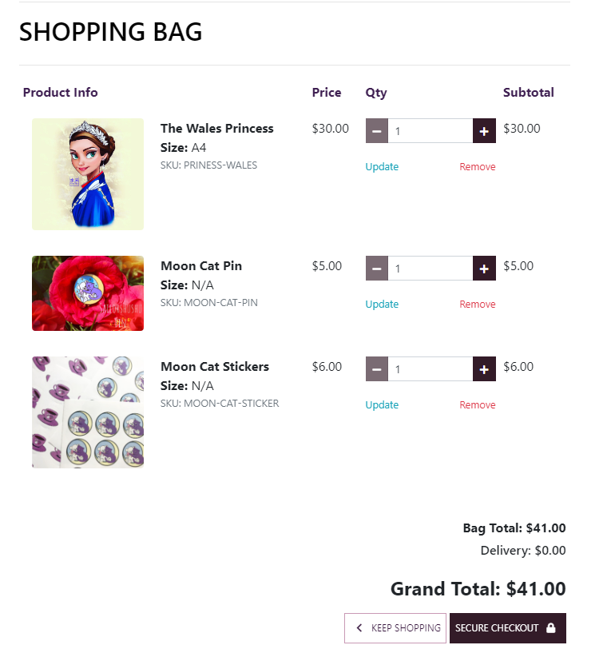

# Silver Moon Kingdom

The official website of a British Artist Sailor Shushu online shop Silver Moon Kingdom. This page is created for Sailor Shushu's fans, as a business to client model and be able to purchaise limited eddition items of her design, if other artist will decide to collaborate, there is an option for more artists to be added and their prints can be sold too.  
 - ! Due to some unfortinate tutoring, the initial project structure callapsed beyond fixing, so the canban board stays with the project 5 folder and this is a copy paste from the project 5 [github link](https://github.com/aslavinska/project5)
 - Due to time limititation it was decided not to copy and paste everything but to keep it within the two repositories. 

# Web Marketing 

* Who are your users?
    - Sailor Shushu Fans
* Which online platforms would you find lots of your users?
    - Instagram and Facebook
* What do your users need? 
    - Cool art products, unique designs in the artists style.
* Would your business run sales or offer discounts? 
    - There is a potential to have deals and discounts and discount codes with stripe. 
* What are the goals of your business?
    - To sale art and unique stickers and pins made in UK. 
* Which marketing strategies would offer the best ways to meet those goals?
    - Seller to Client direct advertismenet without 3rd party. 
* Would your business have a budget to spend on advertising? 
    - No, will work with free or low cost options to market itself. 

- **Facebook Business page**

- This is a mock facebook page that could be deleted by Facebook, as the business is not real. 

# Features

- **Navigation**
    - Featuring at the top of the main page, the name of the online shop Silver Moon Kingdom.
    - The other navigation links are: All Products, Pins & Stickers and Prints, Login/Logout and Register options. 
    - The navigation is in a font visible and readable for a user and color that contrasts with the background. 
    - The navigation clearly tells to the user the name of the website, and makes the different sections of information easy to find. 
    - Search bar is available on the top of the page
    - In the Footer users can find link to the facebook page of the shop and subscripe for newsletter. 

- **The Main Page**
    - The header shows the name of the app, using the other color chosen: Shade of Orange with hand writing type of font theme. 
    - Thi section provides the user with clear information about what the site is and who is the targetted audience. 

- **Online Shop**
    - One-time sale model is used
    - Business to client model, where the art creater sales her art directly to her fans. 

- **Product Management Section**
    - The about section gives details background about artist and motivation behind each art.
    - Admin can edit, delete and add new art prints without login to the admin page. 

- **Basket Section**
- Shopping bag
   

-Checkout
   

-**Login/Logout/Register**

    - Users can register using their email and password, the admin needs to approve every user in  the admin menu
    - Users are able to use a google account to register, the website will redirect them to the google sign in menu.

   

    - Register panel: 

    

-**User Panel**
    - Here users will be able to find their details username and email and commission requests that they have submitted in the Commission Request menu. 

-**Footer**
 - The fotter includes social media links to the facebook store page and subscription to the mail service.
    
    

# MailChimp
MailChimp is used for subscription to news content and email distribution, the setup from the user panel can be found below:

# Stripe
- **Webhooks**
Stripe is used for handeling payments, webhooks setup can be found below: 

# Project Agile Kanban board:
 - The project kanban board can be found [here](https://github.com/users/aslavinska/projects/3/views/1)

# Testing
 - I have tested this page in brosers: Chrome and Firefox.
 - I confimed that this project is responsive, looks good and functions on all standard screen sizes using the devtools device toolbar.
 - I confirmed that the navigation, home, online time, about me,my blog and login/register/logout are all readable and easy to understand. 
 - I have confirmed that the form works: requires entries in every field, will only accept an email in the email field and the submit button works. 
 - I can confirm that post edit and delete functions work in the UI and models are updated without entering the admin panel.
 
 - User Story 1 Site Pagination Tests: 
        
    1. Verified that pagination is shown on the page load.
    2. Made sure that the default page should be selected on the page load.
    3. Checked proper space should be added for clicking on the links and buttons for both mobile and desktop screens.
    4. Made sure colour the text is changing when hover over the menu.
    5. Verified the font size and color for the pagination should be same as per design and requirement.
    6. Verified accurate results should be generated by clicking the buttons.
    7. Tested the data loading time on the page as the user clicks on the links.

- User Story 2 Open a post Tests:
    1. Verified that post is shown on the page load when clicked.
    2. Made sure comments are shown after approval. 
    3. Made sure number of likes and comments, text is shown in the main blog page and in the open post pages. 
    4. All menu links are working. 

- User Story 3 Manage Posts Tests:
    1. Made sure in the admin menu all CRUD functions are available to maintain the post. 

- User Story 4 Create Drafts
    1. In the admin menu draft and post options are available for the admin to choose. If Draft is selected the post will not be visible to any users on the main post page. 

- User Story 5 Approve Comments 
    1. The admin will get all comments for approval and will be able to use admin panel to approve the comments.

- User Story 6 - has been deleted an error was made 

- User Story 7 View Post List 
    1. In the main post view all posts are visible.
    2. Time and date of posting is clear and visible and author of the post is available to see.

- User Story 8  View Likes
    1. Number of likes and comments is clear under each post.

- User Story 9 View comments
    1. All comments that were approved by the admin are visible to users in comment section. 

- User Story 10 Account Registration 
    1. Verified that only users that are registered can comment and like posts and can request commisions and update their commission requests. 

- User Story 11 Comment on a post 
    1. Verified that only logged in users can comment on posts. 

- User Story 12 Like/Unlike 
    1. Verified that only logged in users can like and retrieve their like under a post. 

- User Story 13 Template looks and menu 
    1. Repeated tests from the user story 1. 

- User Story 14 Social App feature login 
    1. Verified that login via Google account is available and working 

- User Story 15 Display number of comments 
    1. Verified that logged in users can see number of comments under each post under post preview. 

- User Story 16 Edit Delete posts for admin 
    1. verified that only admin/post author can see edit and delete buttons inside each post. 
    2. verified that only admin/author can edit a post content 
    3. verified that only admin/author can delete a post. 

- User Story 17 Commission Request form 
    1. Verified that only logged in users can see commission request form
    2. verified that Admin can see in the admin menu commission requests under Appointment menu. 

- User Story 18 Edit Commission Request 
    1. Verified that only commission request author can edit the request from, all fields can be modified. 

- User Story 18 Edit Complete Order Request 
    1. Verified that only order request can be completed using stripe.

    
    
 ## Bugs 
    - No known bugs

 ### Solved bugs
    - When users were trying to register the page was returning error 500, that was fixed by adding ACCOUNT_EMAIL_VERIFICATION as none. 

## Validator Testing 

- HTML 
    - No errors were returned when passing through the official [W3C validator](https://validator.w3.org/).
    - Every page has been checked and no errors or warnings have been highlighted. 
- CSS 
    - No errors were returned when passing through the official [(Jigsaw) validator](https://jigsaw.w3.org/).
    

- Accessibility
    - I confimed that the colors and fonts chosen are easy to read and accessible by running it through lighthouse in devtools. 
    
- JS 
    - No errors were found using [jshint validator](https://jshint.com/)

## Manual Testing

- Every page has been manually tested:
    - Screen resize on different devices 
    - Making sure everything is visible and does not look out of place 

## Unfixed Bugs

No unfixed bugs that have been identified. 

# Deployment 

The site was deployed to Heroku using followin steps:
1. Debug flag in setting.py is set to False
2. X_FRAME_OPTIONS was added to settings.py file and set to sameorigin
3. Everything added, committed and pushed to github. 
4. Disable collecstatic variable has been removed from the heroku app config vars list
5. In Heroku project in the deploy tab the main branch has been deployed. 

The lie link can be found here - [Silver Moon Kingdom](https://silvermoonkingdom-c796635f5b8d.herokuapp.com/).

# Technologies used
    - [Cookiecutter](https://cookiecutter-django.readthedocs.io/en/latest/). 
    - mailchimp [doc](https://mailchimp.com/developer/marketing/docs/fundamentals/) 
    - [Stripe docs](https://stripe.com/docs?locale=en-GB)

# Credits

## Content
The code example for layout and social media links was taken from Code Institute Boutique Project. 
The template for the Read.me file has been taked from Code Institute. 
Manual Test Examples can be found [here.](https://onlinetestcase.com/test-cases-for-pagination/)

## Media
All images in the blog and main pages were take from private Sailor Shushu official archives. All rights reserved.

